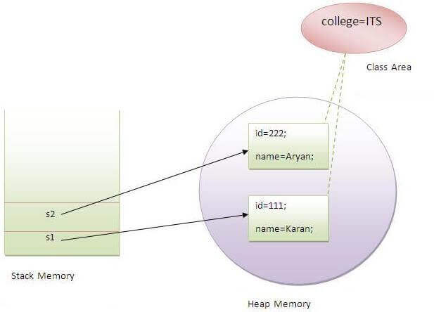
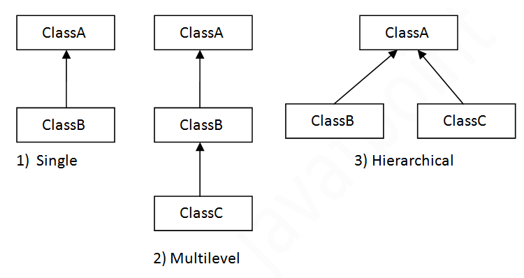
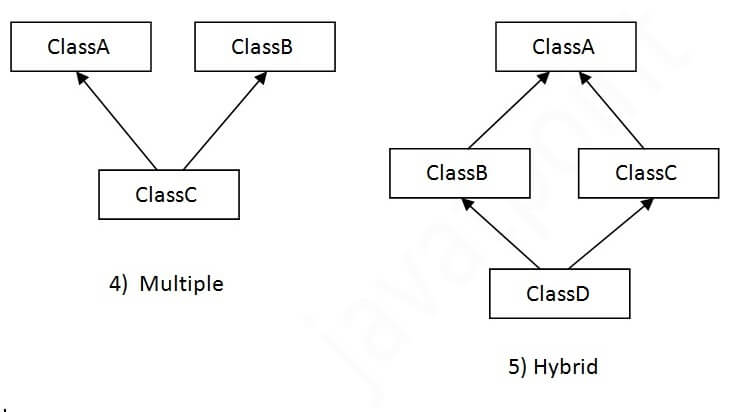

## `Abstract Method`
- Do not have body
- class must be abstract
- Abstract class can have non-abstarct methode with body;

#### methode which `extends` must : 
- Implement abstract methods ie implement body.
- It can implement own methods

```java
        public abstract class ExClass{
            public abstract void methode_1();
            public void methode_2(){ /*body*/ }
        }
        --------------------------------
        public class MyClass extends ExClass{
            public void methode_1(){ /*body*/ }
            public void methode_3(){ /*body*/ }
        }
```

## `Static`
- The static variable can be used to refer to the common property of all objects (which is not unique for each object), 
- The static variable gets memory only once in the class area at the time of class loading,  
- The static method can not use non static data member or call non-static method directly.
- this and super cannot be used in static context.

```java
        |                                 | Memory efficient                |
        |---------------------------------|---------------------------------|
        |                                 |                                 |
        |   class Student{                | class Student{                  |
        |       int rollno;               |     int rollno;                 |
        |       String name;              |     String name;                |
        |       String college="ITS";     |     static String college="ITS";|
        |   }                             | }                               |
```



```java
    class A{  
    int a=40;//non static  
    public static void main(String args[]){  
        System.out.println(a);  // will give error
    }  
    }   
```

## `this`
- this is a reference variable that refers to the current object.  
`Usages:`
    - this can be used to refer current class instance variable.  
    - this can be used to invoke current class method (implicitly)
    - this() can be used to invoke current class constructor.
    - this can be passed as an argument in the method call.
```java
            class S2{  
                void m(S2 obj){  
                    System.out.println("method is invoked");  
                }  
                void p(){  
                    m(this);  
                }
            }  
```
    - this can be passed as argument in the constructor call.
    - this can be used to return the current class instance from the method.
```java
            public class Num {
                public int a=0;
                public Num add(int num){
                    a= a+num;
                    return this;
                }
            }
            //it can use as ---------
            Num num = new Num();
            num.add(1).add(2).add(3).add(4);
            System.out.println(num.a); //output: 10
```


## `Inheritance`
one object acquires all the properties and behaviors of a parent object   
Importance :
- For Method Overriding (so runtime polymorphism can be achieved).
- For Code Reusability.             
```java
class Subclass-name extends Superclass-name  {  /*methods and fields*/  }  
```

### `Types of Inheritance`
- Single  
- Multilevel   
- Hierarchical  
- ~~Multiple~~  **not supported in java
- ~~Hybrid~~ **not supported in java




#### `Single Inheritance`

```java
class Animal { /* */ } 
class Dog extends Animal { /* */ } 
```
#### `Multilevel Inheritance`
```java
class Animal { /* */ } 
class Dog extends Animal { /* */ } 
class BabyDog extends Dog { /* */ }
```

#### `Hierarchical Inheritance`
```java
class Animal { /* */ } 
class Dog extends Animal { /* */ } 
class CAt extends Animal { /* */ }
```

`Multiple inheritance is not supported in java`  
Consider a scenario where A, B, and C are three classes. The C class inherits A and B classes. If A and B classes have the same method and you call it from child class object, there will be ambiguity to call the method of A or B class.