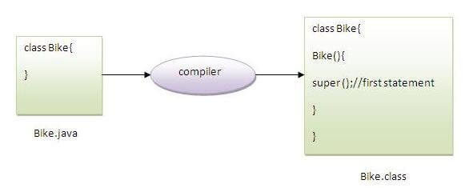

### `Aggregation`
```java
class Address{
    String city;
    String state;
}
class Employee{
    String name;
    Address address; //Aggregation
}
```

### `Method Overloading`
-  having same name but different in parameters   
**It is example of compile time polymorphism**   
`Advantage` : increases the readability of the program.  
```java
class Adder{  
static int  add(int a,  int b )      {return a+b;}  
static int  add(int a,  int b, int b){return a+b+c;} // By changing number of arguments 
static long add(long a, long b) {return a+b;} // By changing the data type
}  

//In java, method overloading is not possible by changing the return type of the method only because of ambiguity.
```
---
```java
class Adder{
static long add(long a, int b) {return a+b;}
static long add(int a, long b) {return a+b;}

public static void main(String[] args) {
    Adder.add(3L,4);
    Adder.add(3,4L);
    Adder.add(3,4);  // compile time error
}
}
```

### `Method Overriding`
If child class has the same method as declared in the parent class.   
**It is example of runtime polymorphism**   

applicable on :
- The method must have the same name as in the parent class
- The method must have the same parameter as in the parent class.
- There must be an IS-A relationship (inheritance).
- **Static methode can not override but static methode can overload**

```java
public class Parent{
    public void meth1(){System.out.println("Parent meth_1");}
}
public class Child extends Parent {
    @Override
    public void meth1(){System.out.println("Child meth_1");}
}

```

### `covariant return type`
The covariant return type specifies that the return type may vary in the same direction as the subclass.
```java
public class Parent{    
    public Parent get() { return this;  }
}
public class Child extends Parent{
    @Override
    public Child get() {    return this;    }
}


```

### `Super`
The super keyword in Java is a reference variable which is used to refer immediate parent class object.
- super can be used to refer immediate parent class instance variable.
- super can be used to invoke immediate parent class method.
- super() can be used to invoke immediate parent class constructor.

```java
public class Parent
{
    int a        =      10; 
}
public class Child extends Parent
{
    int a        =      20;
    int getA()          {    return a;    }
    int getParentA()    {    return super.a;  }
}
public class Main
{
    public static void main(String[] args)
    {
        Child child  =new Child();
        System.out.println(child.getA());//20
        System.out.println(child.getParentA());//10

    }
}
```
  
#### `we cannot stop compiler to not call parent class constructor when we make instance of child class. Or you can call other constructor of parent(overloaded) from child constructor using super()`

```java
public class Parent
{
    int a        =      10; 
    Parent(int a)       {    /* */        }
}
public class Child extends Parent{ /* */ }
```
it will give error. to fix this
- we have to call Parent(int a) constructor in chil class using super();
```java
public class Child extends Parent
{ 
    Child() {     super(12)}
}
```
- Or, we can create a default constructor in parent
```java
public class Parent
{
    int a        =      10; 
    Parent(int a)       {    /* */        }
    Parent() { /* */ }
}
```
- Or, remove all constructor from parent.
```java
public class Parent
{
    int a        =      10; 
}
```
### `Instance initializer block`
- If want to run some task even before constructor.
```java
class A1{
    static{System.out.println("parent static block");}
A1(){ System.out.println("parent"); }
}
class A2{
    static{System.out.println("child static block");}
    A2(){    System.out.println("constructor");    }
    {    System.out.println("before");}     //   _______________________
    {    System.out.println("after");}      //  |     Console
}                                           //  ||``````````````````````     
public class Main                           //  ||     child static block
{                                           //  ||     parent
    public static void main(String[] args){ //  ||     before
       A2 a2 = new A2();                    //  ||     after
    }                                       //  ||     constructor
}                                           //  ||______________________
```

### `Final Keyword`
- Final variabale cannot change
- Final methode cannot override
- Final class cannot extend
```java
-------------------------
public class Main 
{ 
    public static void main(String[] args){
       final int a =10;
       a=12;             // Compile Time Error
    } 
} 
---------------------
class Bike{  
  final void run(){System.out.println("running");}  }  
class Honda extends Bike{  
   void run(){System.out.println("running safely with 100kmph");}}          // Compile Time Error
------------
class Bike{  
  final void run(){System.out.println("running");}  }  
class Honda extends Bike{  /* */}  // Compile Time Error   
```

- if a final variable is not initialized then it can initialze in constructor
- static final variable can initialize in static block

